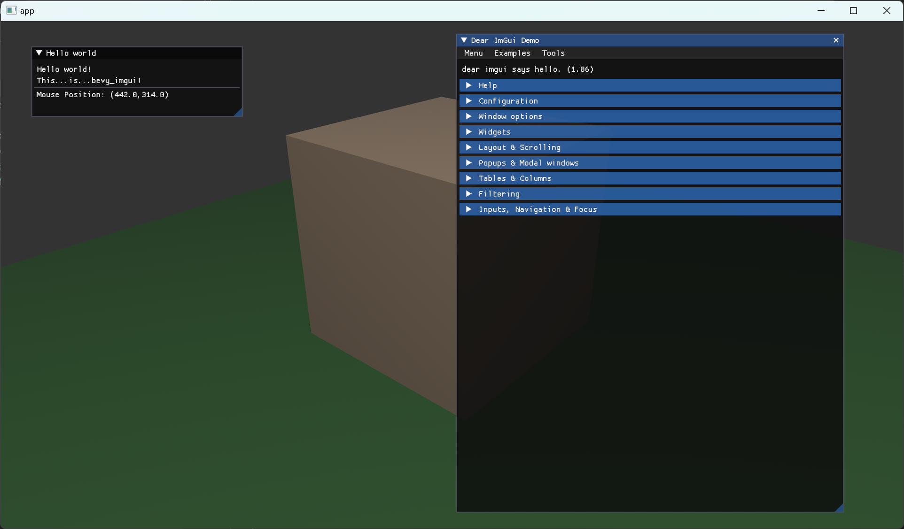

# bevy_mod_imgui

A Dear ImGui integration for the Bevy game engine.

## Current Status

Note that this repository should be treated as **experimental** at the moment. I threw this together very
quickly to get something up and running for some personal projects.

This crate has only been tested on Windows (DX12 and Vulcan).

This crate is not related to any official Bevy organisation repository in any way.

## Feedback Saught

If you're interested in playing with this crate, I'd be keen to hear your thoughts and how you get on with it (sharing your feedback with stars or issues would be very useful!). I'd be particularly interested in hearing whether anyone has any success with this crate on different platforms so I can keep track of this. I'm also happy to receive source code contributions, please do start an issue if you are considering this.

If there is a large enough appetite for this crate, I may consider taking it further...

## Compatibility Table

|`bevy_mod_imgui`|`bevy`  |`wgpu`  |`imgui` |`imgui-wgpu`      |
|----------------|--------|--------|--------|------------------|
| 0.4.*          | 0.14.* | 0.20.* | 0.11.* | 0.24.0 (bundled) |
| 0.3.*          | 0.13.* | 0.19.* | 0.11.* | 0.24.0 (bundled) |
| 0.2.*          | 0.12.* | 0.17.1 | 0.11.* | 0.24.*           |
| 0.1.*          | 0.11.* | 0.16.* | 0.11.* | 0.23.*           |

## Changelog

* `0.4.0` - Updated dependencies for Bevy `0.14.0`. Improved handling of display scale changes.
* `0.3.0` - Updated dependencies for Bevy `0.13.0` with bundled `imgui-wgpu-rs`.
* `0.2.1` - Fix Issue #20 - unchecked window lookup which could cause panic during exit
* `0.2.0` - Updated dependencies for Bevy `0.12.0`
* `0.1.1` - Fix Issue #20 - unchecked window lookup which could cause panic during exit (backported from `0.2.1`)
* `0.1.0` - Initial crate publish

## Contributors

* James Bird (@jbrd)
* @nhlest

## Acknowledgements

This crate builds upon the fantastic work of the following projects:

  * [Dear ImGui](https://github.com/ocornut/imgui)
  * [imgui-rs](https://github.com/imgui-rs/imgui-rs)
  * [imgui-wgpu-rs](https://github.com/Yatekii/imgui-wgpu-rs)
  * [Bevy](https://github.com/bevyengine/bevy)

## License

All code in this repository is permissively dual-licensed under:

* MIT License - [LICENSE-MIT](LICENSE-MIT)
* Apache License, Version 2.0 - [LICENSE-APACHE](LICENSE-APACHE)

## Bundled Software License Notices

### imgui-wgpu-rs

This software contains portions of code derived from [imgui-wgpu-rs](https://github.com/Yatekii/imgui-wgpu-rs/tree/master).
https://github.com/Yatekii/imgui-wgpu-rs/tree/master
Licensed under the Apache License

Copyright (c) 2019 Steven Wittens

Permission is hereby granted, free of charge, to any person obtaining a copy of this software and associated documentation files (the "Software"), to deal in the Software without restriction, including without limitation the rights to use, copy, modify, merge, publish, distribute, sublicense, and/or sell copies of the Software, and to permit persons to whom the Software is furnished to do so, subject to the following conditions:

The above copyright notice and this permission notice shall be included in all copies or substantial portions of the Software.

THE SOFTWARE IS PROVIDED "AS IS", WITHOUT WARRANTY OF ANY KIND, EXPRESS OR IMPLIED, INCLUDING BUT NOT LIMITED TO THE WARRANTIES OF MERCHANTABILITY, FITNESS FOR A PARTICULAR PURPOSE AND NONINFRINGEMENT. IN NO EVENT SHALL THE AUTHORS OR COPYRIGHT HOLDERS BE LIABLE FOR ANY CLAIM, DAMAGES OR OTHER LIABILITY, WHETHER IN AN ACTION OF CONTRACT, TORT OR OTHERWISE, ARISING FROM, OUT OF OR IN CONNECTION WITH THE SOFTWARE OR THE USE OR OTHER DEALINGS IN THE SOFTWARE.